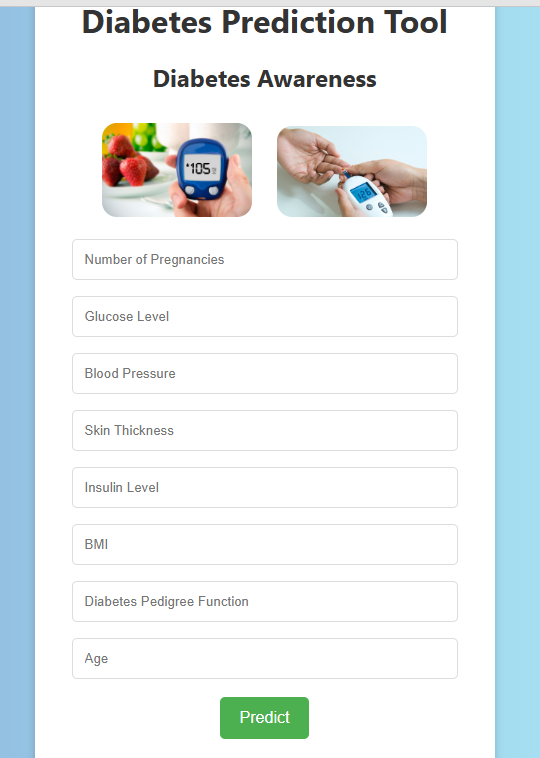

# Diabetes Prediction Project


This project is a Machine Learning model that predicts whether a person is likely to have diabetes or not based on certain medical parameters.

## 🚀 Project Description
The goal of this project is to build a prediction system that helps in early detection of diabetes using supervised learning techniques.

We used the **Pima Indians Diabetes Dataset** for training the model.

---

## 📂 Project Structure
Diabetes-Prediction-Project
│
├── model.pkl # Trained ML Model
├── app.py # Flask Application
├── templates/
│ └── index.html # Frontend HTML file
├── static/
│ └── style.css # CSS styling (if any)
└── README.md # Project Documentation

---

## ⚙️ Technologies Used
- Python
- Pandas
- NumPy
- Scikit-learn
- Flask (for web application)
- HTML, CSS (for user interface)

---

## 📊 Features
- Predicts whether a person is diabetic or not based on input parameters.
- User-friendly web interface using Flask.
- Real-time predictions.

---

## 💻 How to Run the Project
1. Clone the repository:
```bash
git clone https://github.com/Dhanasree2/Diabetes-Prediction-Project.git

2. Install required libraries:
flask
numpy
pandas
scikit-learn

pip install -r requirements.txt

3.Run the Flask app:
python app.py

4. Open your browser and go to:
http://127.0.0.1:5000/

📚 Dataset
Dataset Source: Pima Indians Diabetes Dataset

🙋‍♀️ Author
Dhanasree
GitHub: Dhanasree2

🌟 Acknowledgements
Thanks to Kaggle for the dataset.
Special thanks to the mentors and guides who supported this project.

## 📸 Screenshots

### Home Page


### Prediction Result

(screenshot 2025-06-12 143833.png)


